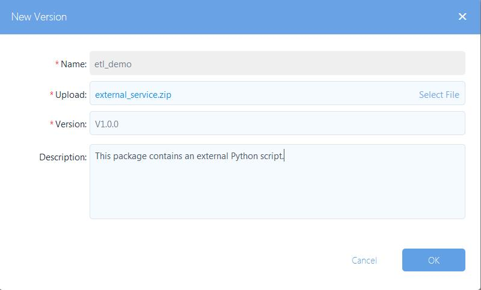
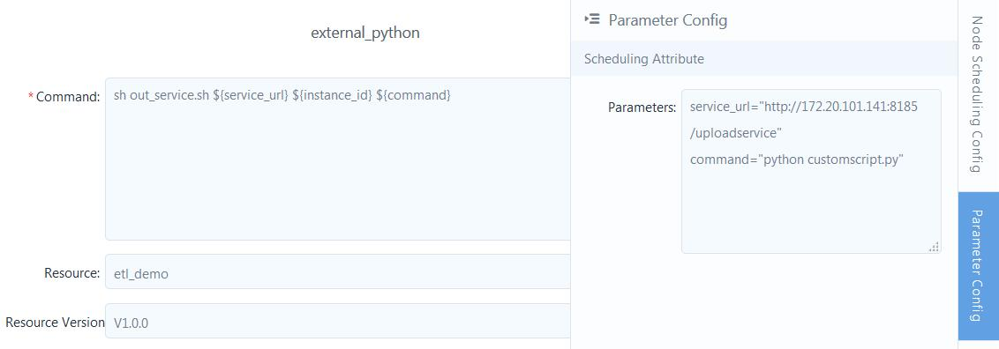
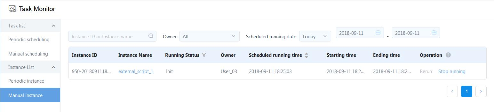
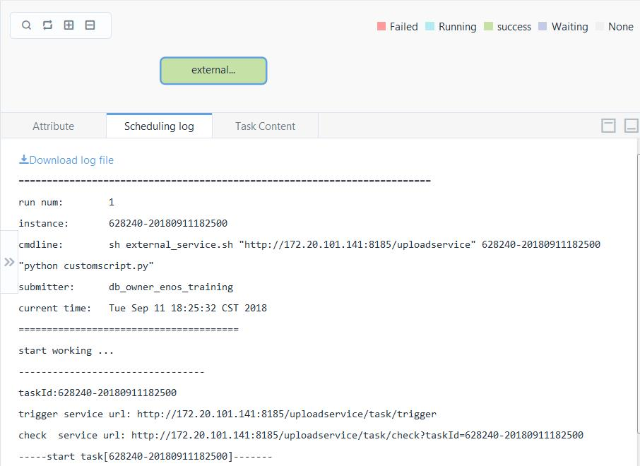

# Using EnOS Data IDE to run an external Python script

Use the `external_service.sh` script with EnOS Data IDE to run your owner Python script.

## About the script

In this example, the `external_service.sh` script runs the [`customscript.py`](../customscript.py) python script. You can replace the `customscript.py` with your own python script.

## How to use the script

Step 1. Fork this repo to your local file system.

Step 2. From your file system, open the directory that you forked in Step 1 and replace the `customscript.py` file with your own Python script.

Step 3. Compress all files in the directory into a `.zip` file, for example, `external_service.zip`.

Step 4. Upload the `.zip` file as a resource of EnOS in the following procedure:

1. In the EnOS Console, click **Data IDE > Resource Management** from the left navigation panel and click **Create Resource**.
2. In the **Create Resource** window, provide the basic settings about the resource.
   - Name: Enter the name of resource.
   - Description: Provide a descriptive information about the resource.
   - Select Directory: Select the directy to save the resource.
	 Click **OK**.

3. Click **New version** and upload the `external_service.zip` file with settings as shown in the following figure:
	 

Step 5. Create a workflow with a task that references the resource.
1. In the EnOS Console, click **Data IDE > Task Designer** from the left navigation panel and click **New Workflow**.
2. In the **New Workflow** window, provide the following settings about the workflow:
	 - **Mode**: Create.
	 - **Name**: external_script_1
	 - **Type**: Manual Scheduling
	 - Select Dir: the directory where you want to store the workflow.
	 Click **OK**.

3. From the **Component** panel, drag the **SHELL** type of task node into the workflow panel.
4. In the **New Task Node** window, provide name and description of the task. Click **Create**.
5. Double click the task node that you just created and provide the following settings about the task:
	 - **Command**: enter the following command:
	 ```
	 sh external_service.sh ${service_url} ${instance_id} ${command}
	 ```
	 where,
	 	- *service_url* and *command* are parameters that you'll define in the **Parameter Config** tab.
	 	- *_instance_id_* is a system variable that indicates the identifier of the workflow instance.
	 - Select the resource and resource version that you uploaded in Step 4.

6. Click the **Parameter Config** tab from the right edge of the task configuration panel and provide the following settings:
	```
	service_url="http://172.20.101.141:8185/uploadservice"    
	command="python customscript.py"  
	```
  **Note**: If your Python script uses a different file name, you'll need to edit the value of `command` with the name of your script file.

	The following figure shows the task configuration in this example.
	

7. Click **Save**. Click **Back to workflow panel** and click **Release** to publish the workflow.

Step 6. Click **Pre-run** to run the workflow.

## Verify the results   

After you pre-run the workflow, a workflow instance is generated. You can then trace the details about the instance through the task monitor:
1. In the EnOS Console, click **Task Monitor** from the left navigation panel.
2. Click **Manual instance** and locate the instance through the name of the workflow. The workflow instance is shown as in the following figure:
	 
3. Click the name of instance from the table and double-click the task from the panel. You can then view the log by clicking the **Scheduling Log** tab.
   
